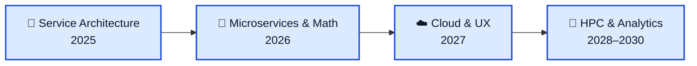

# ZuriMarket

## The open prediction market engine for everyone

ZuriMarket is a powerful, self-hosted prediction market engine designed to let anyone – individuals, classrooms, companies, and communities – tap into the collective intelligence of prediction markets.

---

## 🚀 Features at a Glance

### Core Platform
- **Kinetic Ledger**: Real-time sentiment and betting engine for dynamic odds calculation.
- **Market Types**: Support for **Binary** (Yes/No) and **Multiple Choice** (3+ outcomes) markets.
- **Discovery**: Landing page grid with filtering by category (Crypto, Politics, Sports, Business) and status.
- **Social & Gamification**: Global and per-market leaderboards, activity feeds, and detailed user profiles.

### Security & Infrastructure
- **JWT Authentication**: Secure, stateless user access management.
- **Input Sanitization**: Protection against XSS (Bluemonday) and structured input validation.
- **Modern Design**: High-contrast dark aesthetic using **Space Grotesk** and **Satoshi** typography.
- **Admin Dashboard**: Full control over user creation, market resolution, and homepage CMS.

---

## 🛠️ Tech Stack

| Layer | Technology |
|---|---|
| **Backend** | Go 1.25+, Gorilla Mux, GORM |
| **Database** | PostgreSQL (Production), SQLite (Local/Dev) |
| **Frontend** | React 18, Vite, Tailwind CSS |
| **Charts** | Chart.js, Recharts, CanvasJS |
| **Auth** | JWT (golang-jwt), bcrypt passwords |
| **Infra** | Docker, Nginx, Traefik |

---

## 📅 Roadmap

We’re building ZuriMarket as the best free prediction-market infrastructure you can run yourself.

### Current Priorities
1. **Critical Integrity**: Implementing DB transactions for all financial operations.
2. **Security Hardening**: Hardening JWT secrets, CORS policies, and SSL defaults.
3. **User Flow**: Self-service registration with email verification.
4. **Governance**: Market submission queue and admin approval workflow.

---

## 🏁 Getting Started

### Setting up a Local Instance
- [Info on Local Setup](/README/LOCAL_SETUP.md)
- [Economics Customization](/README/README-CONFIG.md)

### Deploying to the Web
- [Stage Setup Guide](/README/STAGE_SETUP.md)

### How Prediction Markets Work
Check out our quick primer on [how (and why) prediction markets work](/README/MATH/README-MATH.md).

---

## ⚖️ Licensing

ZuriMarket is available under the [MIT License](/LICENSE).

---

## 🤝 Contributing

We welcome contributions! Get started by reading our [guide](/CONTRIBUTING.md) and following our [Code of Conduct](/CODE_OF_CONDUCT.md).

---

## 📍 Where to Next?
- [Development Conventions](/README/README-CONVENTIONS.md)
- [Ongoing Projects](../../projects)
- [Issues](../../issues)
